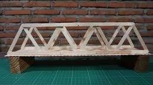

# Project: Stick Bridge Building (Dare You if it Falls)

## What?
You'll be constructing a bridge using ice-cream sticks and glue, but with a twist! No traditional designs allowed here—get creative with your constructions. Experiment with various designs to determine which one can bear the most weight before collapsing. 🌉

## How?
### Step 1: Building the Bridge
- **Utilize** ice-cream sticks and glue to craft your bridge.
- **Embrace creativity** and explore unconventional designs.
- **Test the structural integrity** of each design by assessing its ability to withstand weight. 🛠️

### Step 2: Adding Payload
- **Once your bridge is built,** stack it with a payload to assess its utility.
- Consider the **center of gravity** and the **overall structural integrity** as you add weight to your creation. 🏋️‍♂️

## Task
Construct a bridge using limited resources, focusing on creativity and innovation. Experiment with different designs to determine which one can bear the most weight. Dare yourself to push the limits of traditional construction methods. 💪

## Connect | Contribute | Build ... with Taksh! 🚀

